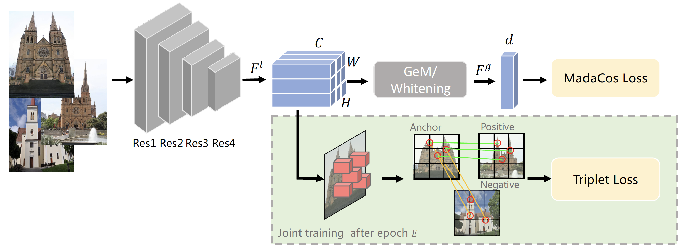

# Coarse-to-Fine: Learning Compact Discriminative Representation for Single-Stage Image Retrieval

> Official Pytorch Implementation of the paper "[**Coarse-to-Fine: Learning Compact Discriminative Representation for Single-Stage Image Retrieval**](https://openaccess.thecvf.com/content/ICCV2023/papers/Zhu_Coarse-to-Fine_Learning_Compact_Discriminative_Representation_for_Single-Stage_Image_Retrieval_ICCV_2023_paper.pdf)"<br>
> _accept to **ICCV 2023**_ <br>
> 

### Overall architecture
<p align="middle">
    
</p>


## Codes

### Requirements

- NVIDIA GPU, Linux, Python3(tested on 3.6.8)
- Tested with CUDA 11.0 and PyTorch 1.7.0

```
pip install -r requirements.txt
```

### Data preparation
#### Download [Google Landmarks dataset](https://github.com/cvdfoundation/google-landmark) into `datasets/images`. Unzip the files and make the dataset structures as `datasets/data/landmark/train_list.txt`.

#### Download [ROxford5k and RParis6k](https://github.com/filipradenovic/revisitop) into `datasets/images`. Unzip the files and make the directory structures as follows.

```
datasets
  └ images
      └ roxford5k
        └ gnd_roxford5k.pkl
        └ jpg
      └ rparis6k
        └ gnd_rparis6k.pkl
        └ jpg
```
### model weights
You can download pretrained weights from [pemetric](https://github.com/feymanpriv/pymetric#pretrained-weights) and download our model weights from [Google Drive](https://drive.google.com/drive/folders/1vHQakmpuyJlDtMw_sDLW4kZopo1glXTE?usp=sharing)


### Training

Set datapath, model, training parameters in configs/resnet50_cfcd_s1_8gpu.yaml and run 

```
sh run_train.sh
```

### Evaluation

1. ROxf and RPar feature extraction, and run 

```
sh evaler/run_extractor_roxford_rparis.sh
```

2. 1M distractor feature extraction, and run 

```
sh evaler/run_extractor_revisitop1m.sh
```

3. Eval on ROxf, RPar and +1M, and run 
```
sh evaler/run_evaluate.sh
```


## 🙏 Acknowledgments
Our pytorch implementation is derived from [DOLG](https://github.com/feymanpriv/DOLG), [Revisiting Oxford and Paris](https://github.com/filipradenovic/revisitop) and [FIRe](https://github.com/naver/FIRe). We thank for these great works and repos.


## ✏️ Citation

If the project helps your research, please consider citing our paper as follows.

```BibTeX
@inproceedings{zhu2023coarse,
  title={Coarse-to-Fine: Learning Compact Discriminative Representation for Single-Stage Image Retrieval},
  author={Zhu, Yunquan and Gao, Xinkai and Ke, Bo and Qiao, Ruizhi and Sun, Xing},
  booktitle={Proceedings of the IEEE/CVF International Conference on Computer Vision},
  pages={11260--11269},
  year={2023}
}

```
